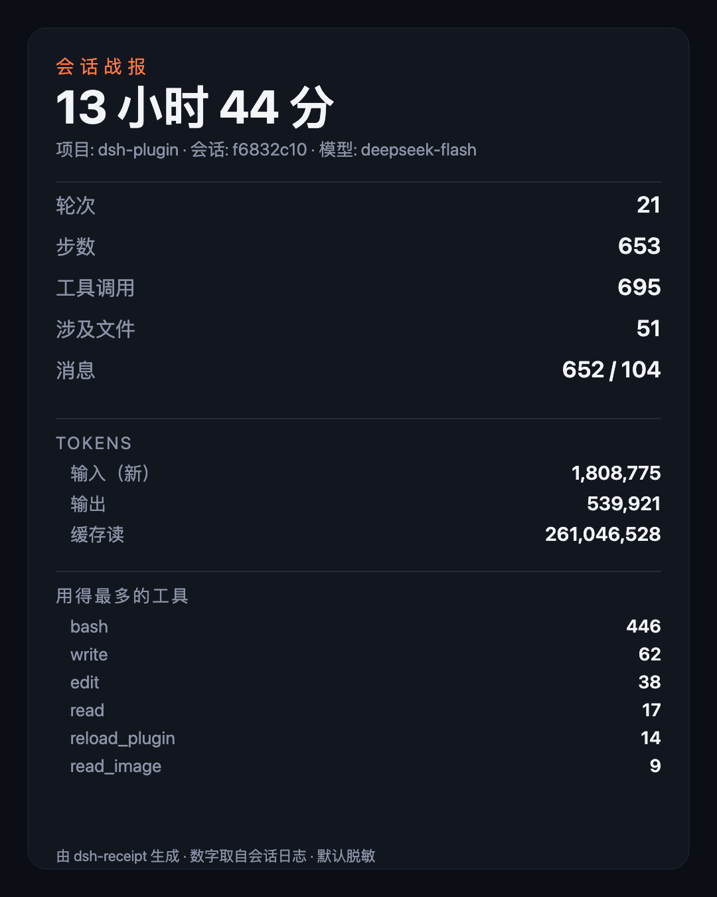
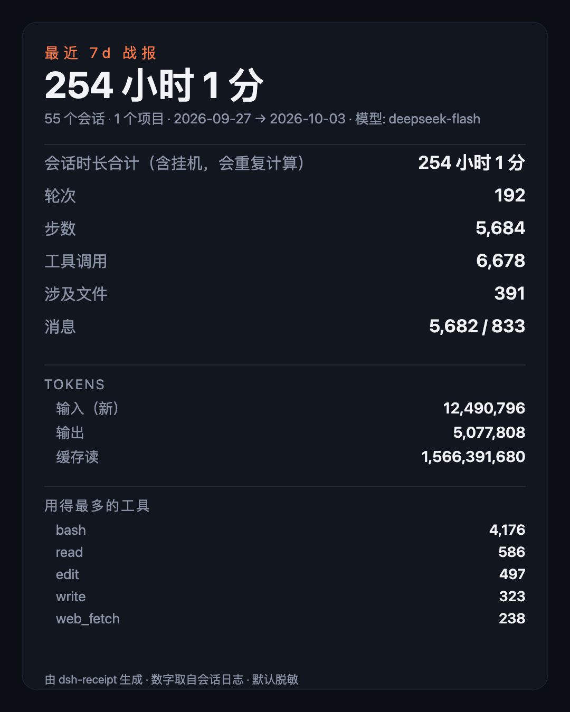

# dsh-receipt

**一次会话，一张战报。** 数字全部来自会话日志，默认脱敏，可以在 X 上直接发。

 

<sub>左：单次会话 · 右：最近 7 天汇总（都是真实输出，见 [docs/README.md](docs/README.md)）</sub>

```sh
npx github:louisyeaaah/dsh-receipt              # 最新一次会话，打印文本战报
npx github:louisyeaaah/dsh-receipt --png receipt.png   # 出一张 1080×1350 的卡片
npx github:louisyeaaah/dsh-receipt --list              # 列出最近的会话
```

> **别用 `npx dsh-receipt`**：npm 上已有的 `dsh-receipt` 是另一个人的包
> （[deronendless/dsh-receipt](https://github.com/deronendless/dsh-receipt)，每轮结束写一份 JSON/Markdown 凭据，
> 没有 `bin`），跑起来不是你想要的东西。这个仓库没发 npm，走 GitHub 路径。

```
会话战报   f6832c10
  项目   dsh-plugin
  模型     deepseek-flash
  时长  13 小时 21 分

  轮次      15
  步数      572
  工具调用  620
  涉及文件      45
  消息    571（我的输入 86）

  tokens
    输入（新）     1,777,902
    输出    478,609
    缓存读    236,763,392

  上下文压缩  14 次（被裁掉 77,897 tokens）

  用得最多的工具：
      384  bash
       57  write
       37  edit
       16  read
       14  reload_plugin
```

（上面是真实输出，不是示意图。）

## 周期战报：把一段时间的所有会话合成一张

```sh
npx github:louisyeaaah/dsh-receipt --since 7d          # 最近 7 天
npx github:louisyeaaah/dsh-receipt --since 30d --project dsh-plugin
npx github:louisyeaaah/dsh-receipt --since 7d --png week.png
```

```
最近 7d 战报
  会话数  55    项目数  1
  时间跨度      143 小时 43 分（2026-09-27 → 2026-10-03）
  会话时长合计（含挂机，会重复计算）  253 小时 34 分

  轮次      186
  步数      5,614
  工具调用  6,609
  涉及文件      389
  tokens: 输入 12,460,512 · 输出 5,028,237 · 缓存读 1,543,818,240

  用得最多的工具：bash 4,129 · read 581 · edit 487 · write 322 · web_fetch 238
```

**口径上诚实的两点**（都写进了输出本身）：

- **时长合计 > 时间跨度是正常的**：每个会话的时长是「首尾事件之差」，包含挂机时间，
  多个会话并行时会重复计算。所以两个数都给：**时间跨度**（真实墙上时间）和**时长合计**。
- **涉及文件是并集去重**：跨会话同名文件只算一次。

## 为什么做这个

build in public 的人要发「今天干了什么」，现在只有两条路：手截一张丑图，或者写一段没有信源的形容词。
dsh-receipt 给第三种：**从会话日志里算出来的真实数字**，配一张能直接发出去的卡片。

## 数字的口径（写清楚，免得被质疑）

| 字段 | 怎么算的 |
| --- | --- |
| 时长 | 第一个事件到最后一个事件的时间差（不是你坐在电脑前的时间） |
| 轮次 | 你的每一次输入算一轮（`turn/start` 去重） |
| 步数 | 模型的每一次响应算一步（`step/start` 去重） |
| 工具调用 | `tool/call` 事件条数，按工具名分组 |
| 涉及文件 | 从工具参数里抽出的文件，同名去重，只保留文件名 |
| tokens | `assistant/message` 上的 usage 累加；**缓存读单独列，不混进输入** |
| 上下文压缩 | `compaction/prune` 次数，以及被裁掉的 token 数 |

## 脱敏

默认就脱敏，不是可选项：

- 项目路径只留最后一段（`/Users/xxx/project/dsh-plugin` → `dsh-plugin`），不暴露用户名
- 文件只出现 basename 和计数，**不出现路径、不出现任何对话内容**
- 会话 id 只显示前 8 位

要看完整路径必须显式 `--show-paths`。

## 不编数字

**没有内置价目表。** 只有你自己给单价时才估成本：

```sh
dsh-receipt --price-in 2 --price-out 8 --price-cache 0.2   # 每百万 token 的美元价
```

价格会变、各家的缓存计价规则也不一样，工具里编一个数字比不给更糟。

## 零依赖

只需要 Node ≥ 22（用到内置的 `zlib`）。没有 npm 依赖，没有 node_modules。

会话文件在 `~/.dsh/sessions/<项目>/session-<id>/session.v4.jsonl.zstd`，
每行一个 JSON 事件；`assistant/message` 上带真实的 usage。

> 实现注意：这个文件是**追加写的多帧 zstd**，而 Node 的 `zstdDecompressSync` /
> `createZstdDecompress` 只解第一帧**而且不报错**（3.7MB 的会话只会读出 1 个事件）。
> 本工具按帧魔数切分逐帧解，`scripts/selftest.mjs` 里有这条回归测试。

## 命令

| 命令 | 作用 |
| --- | --- |
| `dsh-receipt [会话id前缀]` | 文本战报（默认取最新会话） |
| `--since 7d\|24h\|2026-10-01` | **周期战报**：窗口内所有会话合成一份 |
| `--project <名字>` | 只统计某个项目（配合 `--since`） |
| `--list` | 列出最近 20 个会话 |
| `--svg out.svg` | 输出卡片（SVG，1080×1350） |
| `--png out.png` | 输出 PNG（用本机 Chrome 把 SVG 转出来） |
| `--json` | 机器可读 |
| `--lang zh\|en` | 语言 |
| `--theme dark\|light` | 卡片配色 |
| `--show-paths` | 不脱敏 |
| `--price-in/-out/-cache` | 给了才估成本 |

自检：`bash scripts/verify.sh`（语法 + 包元信息 + 33 项离线单测）。

## 和同名工具的区别

npm 上的 [`dsh-receipt`](https://github.com/deronendless/dsh-receipt) 做的是**每轮结束自动落一份凭据文件**
（JSON + Markdown，带 Git 状态、审批审计、SHA-256 完整性摘要，做得很细）。
本工具做的是另一件事：**把整次会话汇总成一张给人看的卡片**，可以直接发出去。

两者不冲突：那份适合审计留档，这张适合发布。要审计留档就用它的。

## 限制

- 只读 DSH 的会话格式（`session.v4`），DSH 改格式就得跟着改；
- 时长的口径是「首尾事件之差」，跨天挂着不动的会话会显得很长；
- 卡片是 SVG 转的 PNG，依赖本机有 Chrome/Chromium/Edge；没有的话 SVG 也能直接发。

MIT
